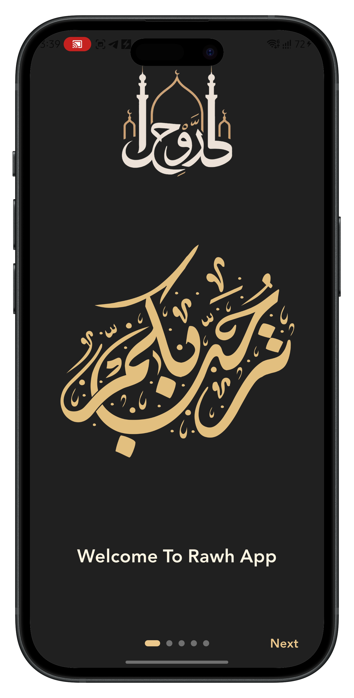
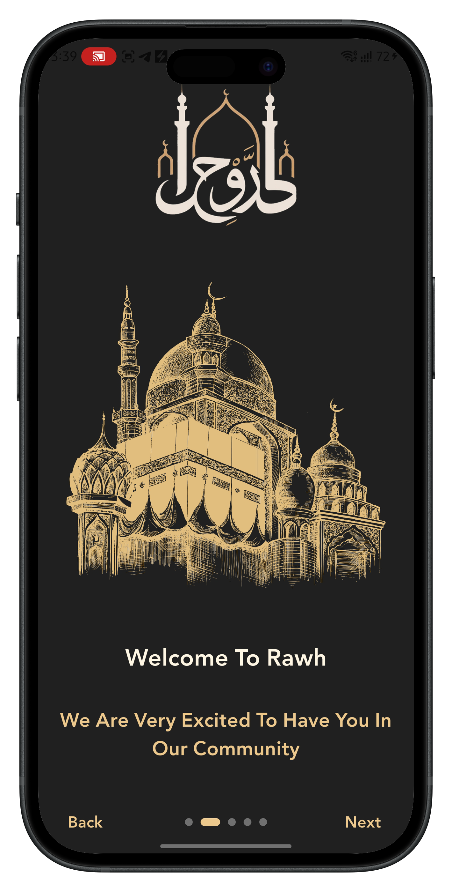
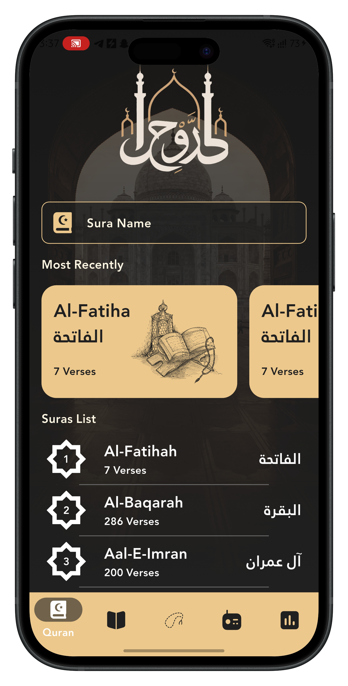
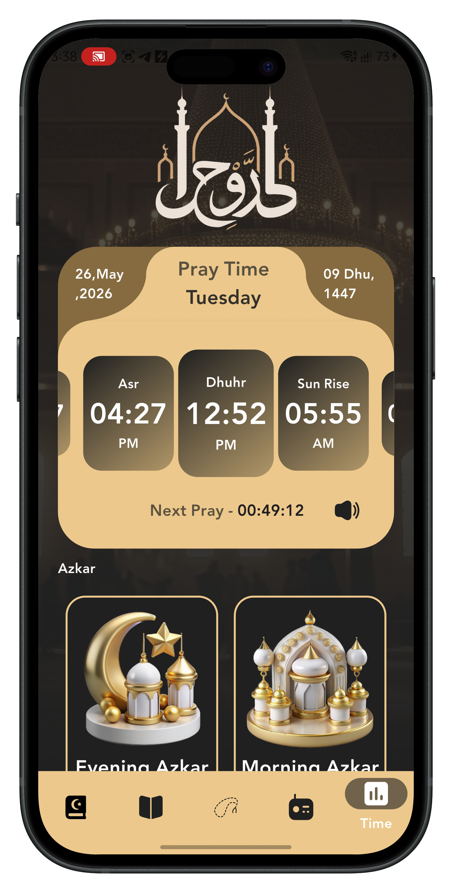
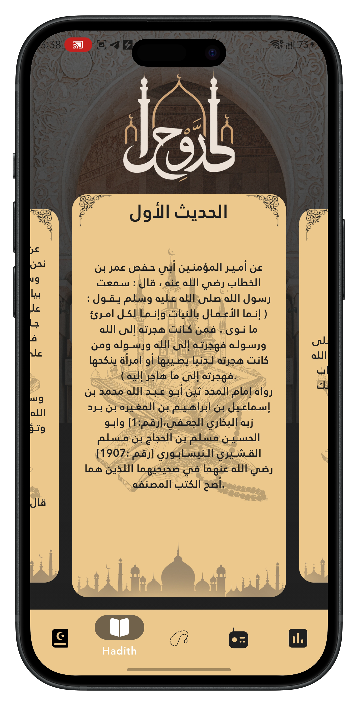
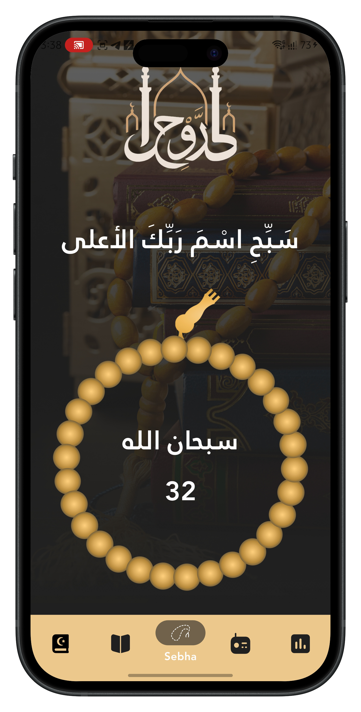
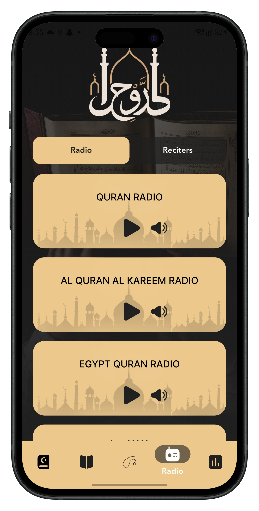
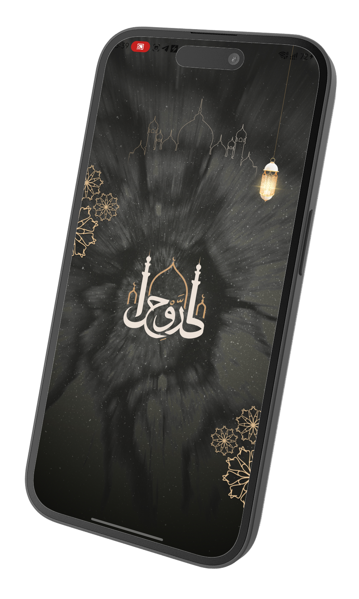

# 🕋 Rāwh | رَّوْحِ – Your Companion in Worship & Remembrance

<p align="center">
  
</p>

<p align="center">
  <a href="https://flutter.dev"></a>
  <a href="https://dart.dev"></a>
  <a href="LICENSE"></a>
  <a href="https://github.com/mohamedismail-dev/rawh_app/releases"></a>
</p>

<p align="center">
  <b>Rāwh</b> — because the soul, too, needs its sustenance.<br>
  From the tranquility of Quran recitation to the accuracy of prayer times and the rhythm of Tasbih, Rāwh combines all essential acts of worship into a single, easy, elegant companion. Designed with a breathtaking dark palette and built to work flawlessly offline, it's the Islamic toolkit you can depend on wherever you are at home, on the road, or in the quiet moments of your night.
</p>

## ✨ App Preview
<p align="center">
  
</p>

---

## 📱 Key Features

| Feature | Description |
|--------|-------------|
| 📖 **Holy Quran (114 Surahs)** | Read and search the full Quran offline. Smart "Recent" section for quick resumption. |
| 🕌 **Accurate Prayer Times & Athan** | Real-time countdown, Hijri/Gregorian dates, and automatic Azan audio trigger when prayer time arrives. |
| 🎧 **Audio Recitations & Live Radio** | Stream or download offline recitations from world-renowned Qaris, plus listen to a 24/7 live Quran radio. |
| 📿 **Digital Tasbih** | Interactive counter with a 33-bead cycle (Subhan Allah, Alhamdulillah, La ilaha illa Allah). |
| 📚 **Authentic Hadith** | A curated collection of verified hadiths for daily inspiration. |
| 🌅 **Morning & Evening Azkar** | Organized grid of daily supplications with categorized access. |
| 🌙 **Dark Spiritual Theme** | Minimalist UI with Deep Charcoal and Rich Islamic Gold (#856B3F). |
| 🚀 **Offline-First Architecture** | All core features work without internet. |

---

## 📸 App Screenshots

<div align="center">
  <h4>Onboarding</h4>
  
  
  
  <h4>Quran & Search | Prayer Times & Azan</h4>
  
  

  <h4>Tasbih, Hadith, Radio</h4>
  
  
  
</div>

---

## 🌙 Ramadan Splash Screen
<p align="center">
  
</p>
<p align="center"><i>Activated during the holy month of Ramadan.</i></p>

---

## 🏗️ Technical Stack & Architecture

- **Framework:** Flutter 3.2+ (Dart 3.0+)
- **State Management:** Provider (or BLoC/Riverpod – if used)
- **Architecture Pattern:** Modular Clean Architecture with separation of UI, logic, and data layers.
- **Offline Data:** Local Quran & Hadith data stored as structured JSON files.
- **Audio Engine:** `audioplayers` for background Azan and on-demand recitation.
- **Localization:** Arabic-first with full RTL support.
- **Performance:** Optimized timer isolation to prevent UI rebuilds on complex widgets (e.g., CarouselSlider).

### Key Packages
| Package | Usage |
|--------|-------|
| `carousel_slider` | Smooth prayer time page transitions |
| `audioplayers` | Azan & Quran playback |
| `hijri` | Hijri calendar conversions |
| `adhan_dart` | Prayer time calculations |
| `flutter_svg` | Vector icons & illustrations |
| `flutter_native_splash` | Native splash screen |

See the complete list in [`pubspec.yaml`](pubspec.yaml).

---

## 🚀 Getting Started

### Prerequisites
- Flutter SDK (^3.2.0)
- Android Studio / VS Code
- A physical device or emulator (API 21+ / iOS 13+)

### Installation

1. **Clone the repository**
   ```bash
   git clone https://github.com/mohamedismail-dev/rawh_app.git
   cd rawh_app
